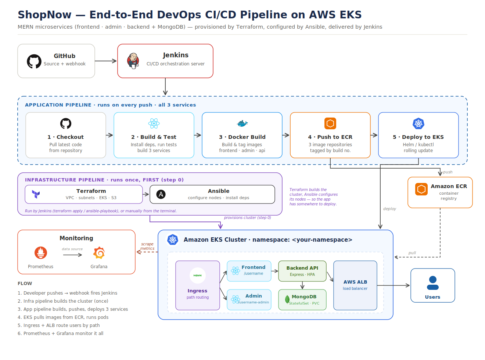

# End-to-End DevOps Pipeline for ShopNow E-Commerce with CI/CD

An end-to-end DevOps pipeline that builds, provisions, configures, deploys, and monitors the **ShopNow** MERN e-commerce application on Amazon EKS, orchestrated by Jenkins.

## Problem Statement
DevOps teams require a CI/CD pipeline to streamline the development and deployment process, ensuring that changes are consistently tested, built, and deployed across environments. Using Jenkins as the CI/CD orchestrator, this project implements an automated pipeline for the Dockerized ShopNow application that deploys to Kubernetes on AWS EKS. Jenkins also automates infrastructure provisioning (Terraform) and configuration management (Ansible), reducing manual intervention and improving efficiency.

## About the Application
ShopNow is a full-stack MERN e-commerce application made up of three independently deployed services backed by a database:

- **Frontend** — React customer-facing storefront, served at `/<username>`
- **Admin** — React admin dashboard, served at `/<username>-admin`
- **Backend** — Express + MongoDB REST API
- **MongoDB** — runs in-cluster as a StatefulSet with persistent storage

## Project Goals
1. Design an application architecture that includes load balancing, container orchestration, and monitoring on AWS.
2. Provision AWS infrastructure using Terraform, including VPC, subnets, and EKS clusters.
3. Automate configuration management with Ansible to streamline server setup and application configuration.
4. Deploy the application on Kubernetes within AWS EKS, ensuring scalability and resilience.
5. Implement Jenkins CI/CD for continuous integration and deployment from code changes to production.
6. Set up monitoring with Prometheus and Grafana to monitor infrastructure and application performance.

## Tech Stack & Tools
| Category | Tools |
|----------|-------|
| CI/CD Orchestration | Jenkins (on EC2) |
| Containerization | Docker |
| Image Registry | Amazon ECR (one repo per service) |
| Infrastructure as Code | Terraform (VPC, subnets, EKS, S3 backend) |
| Configuration Management | Ansible |
| Orchestration | Kubernetes on Amazon EKS, kubectl, Helm |
| Routing | NGINX Ingress Controller + AWS Load Balancer |
| Scaling | Horizontal Pod Autoscaler (HPA), metrics-server |
| Monitoring | Prometheus + Grafana |
| Jenkins Plugins | Docker, Kubernetes CLI, Amazon ECR, Git |

## DevOps CI/CD Pipeline Architecture Flow



### Overview
This architecture demonstrates an automated CI/CD pipeline for deploying the Dockerized ShopNow application on Amazon EKS using Jenkins. The pipeline automates the software delivery process from code commit to production deployment while ensuring scalability, reliability, and continuous monitoring. Infrastructure is provisioned with Terraform and configured with Ansible before the application pipeline runs.

The pipeline is split into two logical flows:
- **Infrastructure pipeline** — Terraform and Ansible, run once (or when infrastructure changes), to stand up the VPC, EKS cluster, and configured nodes.
- **Application pipeline** — runs on every code push, building and deploying the three ShopNow services.

### Architecture Flow

#### 1. Infrastructure Provisioning (Terraform)
Terraform provisions the foundational AWS infrastructure, including:
1. A VPC with public and private subnets across multiple availability zones.
2. An Amazon EKS cluster with a managed node group.
3. Security groups and IAM roles required for the cluster and nodes.
4. An S3 bucket (with a DynamoDB lock table) to store Terraform state remotely for consistent, multi-user access.

Running infrastructure as code makes the environment reproducible and easy to tear down to avoid AWS billing charges.

#### 2. Configuration Management (Ansible)
Ansible playbooks configure the provisioned infrastructure — installing dependencies (Docker, kubectl, AWS CLI), applying access and security settings, and preparing nodes so the application can be deployed consistently. This stage runs after Terraform completes.

#### 3. Developer Commits Code
The process begins when a developer pushes the latest application code to the GitHub repository. A GitHub webhook immediately notifies Jenkins about the new commit, triggering the CI/CD pipeline automatically.

#### 4. Jenkins CI/CD Pipeline
Jenkins acts as the central automation server and orchestrates the entire CI/CD workflow. Once triggered, Jenkins performs the following tasks for **each of the three services** (frontend, admin, backend):
1. Checks out the latest source code from GitHub.
2. Installs project dependencies.
3. Executes automated tests to validate the application.
4. Builds each service.
5. Creates a Docker image for each service.
6. Tags each Docker image with the build version.

This automated process ensures that only tested and validated code progresses through the deployment pipeline.

#### 5. Docker Image Repository (Amazon ECR)
After successfully building the images, Jenkins authenticates to Amazon ECR and pushes the three images to their respective repositories:
- `<username>-shopnow/frontend`
- `<username>-shopnow/admin`
- `<username>-shopnow/backend`

Amazon ECR serves as a secure, centralized container image repository from which Kubernetes pulls the latest application images. Images are tagged with the unique build number so each deployment is traceable and rolling updates trigger correctly.

#### 6. Deployment to Amazon EKS
Jenkins uses Helm (or kubectl) to deploy the latest application version to the Amazon EKS cluster.
The deployment includes:
1. Updating Kubernetes Deployment resources for the three services.
2. Running MongoDB as a StatefulSet with a persistent volume.
3. Creating or updating Kubernetes Services.
4. Configuring Ingress resources for external, path-based access.
5. Applying Horizontal Pod Autoscalers for scalability.

Amazon EKS manages the application containers, automatically maintaining the desired number of running pods and ensuring high availability.

#### 7. Application Load Balancing & Routing
The NGINX Ingress Controller provisions an AWS Application Load Balancer (ALB) and routes traffic by path:
- `/<username>` → frontend (customer storefront)
- `/<username>-admin` → admin dashboard

This provides high availability, improved scalability, fault tolerance, and efficient traffic distribution across multiple application pods.

#### 8. End User Access
Users access the application through the AWS Application Load Balancer. Requests are securely routed by the ingress controller to the appropriate Kubernetes Service, which forwards them to a healthy application pod running within the EKS cluster.

#### 9. Monitoring and Visualization
To ensure operational visibility, Prometheus continuously scrapes metrics from the Kubernetes cluster, application pods, and services. Grafana connects to Prometheus and presents these metrics through interactive dashboards, allowing administrators to monitor:
1. CPU utilization
2. Memory usage
3. Pod health
4. Application availability
5. Cluster performance
6. Request and response metrics

This monitoring solution enables proactive issue detection and performance optimization.

## Project Structure
```
.
├── app/                    # ShopNow source (frontend, admin, backend)
├── terraform/              # VPC, subnets, EKS, S3 backend
├── ansible/                # Node configuration playbooks
├── kubernetes/
│   ├── k8s-manifests/      # Raw Kubernetes YAML
│   └── helm/               # Helm charts per service
├── monitoring/             # Prometheus + Grafana setup
├── jenkins/                # Jenkinsfile(s)
└── README.md
```

## Setup & Deployment

### Prerequisites
- AWS account with CLI configured (`aws configure`)
- Terraform, kubectl, Helm, and Docker installed
- A running Jenkins server on EC2 with the Docker, Kubernetes CLI, Amazon ECR, and Git plugins

### 1. Provision Infrastructure
```bash
cd terraform
terraform init
terraform plan
terraform apply
```

### 2. Configure Nodes
```bash
cd ansible
ansible-playbook -i inventory playbook.yml
```

### 3. Connect to the Cluster
```bash
aws eks update-kubeconfig --region <region> --name <cluster-name>
kubectl get nodes
```

### 4. Run the Jenkins Pipeline
Push a commit to the repository (or trigger the job manually). Jenkins will build, push to ECR, and deploy all three services to EKS.

### 5. Access the Application
- Customer app → `http://<load-balancer-dns>/<username>`
- Admin dashboard → `http://<load-balancer-dns>/<username>-admin`

> **Cost note:** EKS, NAT gateways, and load balancers incur ongoing AWS charges. Run `terraform destroy` after capturing your screenshots to tear everything down.

## Key Benefits
1. Fully automated Continuous Integration and Continuous Deployment.
2. Infrastructure is reproducible and version-controlled through Terraform.
3. Configuration is consistent and automated through Ansible.
4. Containerized applications ensure consistency across environments.
5. Kubernetes provides automatic scaling, self-healing, and high availability.
6. AWS Application Load Balancer with path-based ingress routes traffic to the right service.
7. Amazon ECR provides secure storage for Docker images.
8. Prometheus and Grafana provide real-time monitoring and performance insights.
9. Reduced manual intervention, resulting in improved deployment efficiency and operational reliability.

## Conclusion
This architecture establishes a modern DevOps workflow by integrating GitHub, Jenkins, Docker, Terraform, Ansible, Amazon ECR, Amazon EKS, Kubernetes, Prometheus, and Grafana. The automated pipeline enables rapid, reliable, and scalable deployments of the ShopNow application while ensuring continuous monitoring and simplified application management in the AWS cloud.
